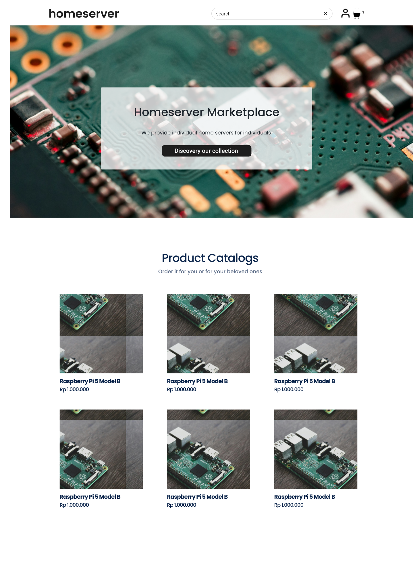
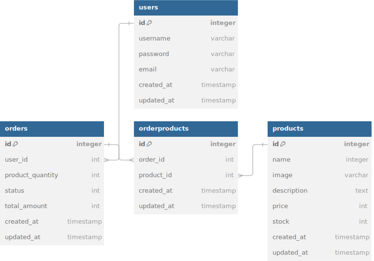

# Home Server

[Home Server](https://homeserver.navinrgh.sit) is a online store that provides a platform for individuals to purchase home server products, such as Raspberry Pi, single-board computers, and related accessories.

Table of Contents:

- [Home Server](#home-server)
  - [Links](#links)
  - [Features](#features)
  - [UI Designs](#ui-designs)
  - [Entity Relationship Diagram (ERD)](#entity-relationship-diagram-erd)

## Links

- Website/Frontend: <https://homeserver.navinrgh.com>
  - Backend: <https://homeserver-backend.navinrgh.com>
- Repositories:
  - General: <https://github.com/navi-0115/homeserver>
  - Backend: <https://github.com/navi-0115/homeserver-backend>
  - Frontend: <https://github.com/navi-0115/homeserver-frontend>

Inspirations:

- <https://servermall.com/>
- <https://bambino.budigunawan.com>
- <https://us.dollarshaveclub.com/collections/shave-sets>

## Features

- Home page
  - Hero section
  - Products catalogue. Example: <https://bambino.budigunawan.com>
- Product page
  - Image
  - Name
  - Price
  - Description
  - Add to cart form: quantity input & add to cart button
- Shopping cart page
  - Product items to buy
    - Image, name, price, quantity, total (price x quantity)
    - Remove item
  - Link: continue shopping, go to products catalogue
  - Link: checkout
- Checkout page
  - Order summary
    - Product items to buy
    - Grand total of all product items to buy

## UI Designs

- Figma URL: <https://www.figma.com/design/vH4MyTnT20CLf9MKW7dKLO/Home-Server-E-Commerce?node-id=0-1&t=ZqHwyYDMnEjdAEgU-1>
- 

## Entity Relationship Diagram (ERD)

- ERD URL: <https://dbdiagram.io/d/homeserver-erdiagram-66ed22e7a0828f8aa67a10db>
- ERD Image
  

## REST API Endpoints

- Production: `https://homeserver.navinrgh.site`
- Local: `http://localhost:3000`

| Endpoint         | HTTP     | Description               |
| ---------------- | -------- | ------------------------- |
| `/`              | `GET`    | Home Page                 |
| `/products`      | `GET`    | Get all products          |
| `/products/:id`  | `GET`    | Get product by id         |
| `/products/seed` | `POST`   | Seed all initial products |
| `/products`      | `POST`   | Add new product           |
| `/products`      | `DELETE` | Delete all products       |
| `/products/:id`  | `DELETE` | Delete product by id      |
| `/products/:id`  | `PUT`    | Update product by id      |
| `/orders`        | `POST`   | Add new product           |
| `/orders`        | `DELETE` | Delete all products       |
| `/orders/:id`    | `DELETE` | Delete product by id      |
| `/orders/:id`    | `PUT`    | Update product by id      |

### Product

```json
{
  "id": "1",
  "name": "Rasberry Pi 5",
  "price": 1200000
}
```

### Add New Product

Response Body:

```json
{
  "id": "1",
  "name": "Rasberry Pi 5",
  "price": 1200000,
  "description": "Raspberry Pi 5 features the Broadcom BCM2712 quad-core Arm Cortex A76 processor @ 2.4GHz, making it up to three times faster than the previous generation"
}
```
